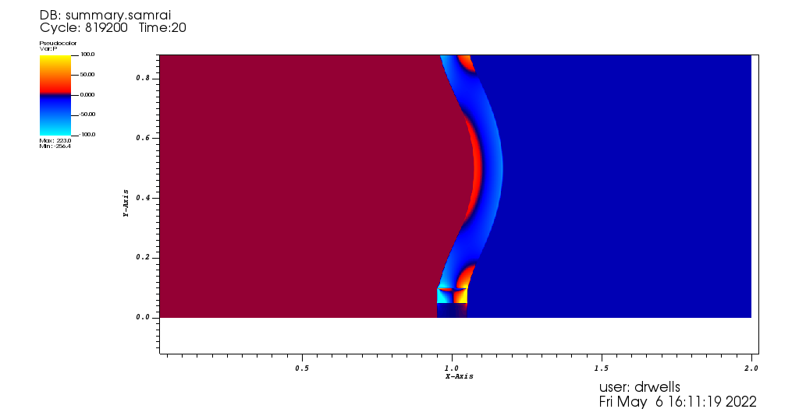

# Elastic band example

## Overview

This is adopted from a common IBFE benchmark used by Jae-Ho Lee in

https://arxiv.org/pdf/2105.14536.pdf

and Ben Vadala-Roth in

https://arxiv.org/pdf/1811.06620.pdf

Here, the velocity converges to zero and the pressure converges to 5 on the left
and -5 on the right (in the picture above we obtain 4.99998 and -4.9996,
respectively).

## Performance

If we run at `N = 512` we get a `512 x 1024` grid. Executing this with 32
processors on a workstation with a final time `END_TIME = 20.0` yields the
following performance data:

    At end       of timestep # 819199
    Simulation time is 20
    +++++++++++++++++++++++++++++++++++++++++++++++++++

    Writing visualization files...

    Writing timer data...

    ++++++++++++++++++++++++++++++++++++++++++++++++++++++++++++++++++++++++++++++++
    WALLCLOCK TIME
    PROCESSOR: 0
    ++++++++++++++++++++++++++++++++++++++++++++++++++++++++++++++++++++++++++++++++
                                                                    Timer Name           Total
                                IBTK::HierarchyIntegrator::advanceHierarchy()   89651.6 (99%)
                                       fdl::IFEDMethod::interpolateVelocity()     33519 (37%)
                                  fdl::IFEDMethod::interpolateVelocity()[rhs]   21485.2 (23%)
                                 IBTK::PETScKrylovLinearSolver::solveSystem()     18781 (20%)
                                               fdl::IFEDMethod::spreadForce()   14819.7 (16%)
                IBAMR::StaggeredStokesProjectionPreconditioner::solveSystem()   13050.1 (14%)
                                    fdl::IFEDMethod::computeLagrangianForce()   12195.7 (13%)
                                             xfer::RefineSchedule::fillData()   10593.4 (11%)
                                         xfer::RefineSchedule::recursive_fill   10527.4 (11%)
                               fdl::IFEDMethod::computeLagrangianForce()[pk1]   10289.5 (11%)
                                                tbox::Schedule::communicate()   9969.04 (11%)
         IBAMR::INSStaggeredPPMConvectiveOperator::applyConvectiveOperator()    8219.94 (9%)
                      IBTK::SecondaryHierarchy::transferPrimaryToSecondary()    7288.76 (8%)
                              IBTK::SCPoissonHypreLevelSolver::solveSystem()    7190.01 (7%)
                       IBTK::SCPoissonHypreLevelSolver::solveSystem()[hypre]    5935.22 (6%)
                               fdl::IFEDMethod::interpolateVelocity()[solve]    4738.29 (5%)
                              IBTK::CCPoissonHypreLevelSolver::solveSystem()    3319.91 (3%)
                       IBTK::CCPoissonHypreLevelSolver::solveSystem()[hypre]    2875.91 (3%)
                      IBTK::SecondaryHierarchy::transferSecondaryToPrimary()    2199.74 (2%)
                                     IBAMR::StaggeredStokesOperator::apply()    2163.21 (2%)
                            fdl::IFEDMethod::computeLagrangianForce()[solve]    1766.84 (1%)
                           IBTK::HierarchyGhostCellInterpolation::fillData()    1436.22 (1%)
                   IBTK::HierarchyGhostCellInterpolation::fillData()[refine]    1059.69 (1%)
                                                               TOTAL RUN TIME:  90241.9 (100%)
    ++++++++++++++++++++++++++++++++++++++++++++++++++++++++++++++++++++++++++++++++

    +++++++++++++++++++++++++++++++++++++++++++++++++++
    Computing error norms.

    Error in u at time 20:
    L1-norm:  3.235273057358905e-06
    L2-norm:  4.223735864788586e-06
    max-norm: 0.0002307101299190117
    +++++++++++++++++++++++++++++++++++++++++++++++++++

The rate of convergence is typically measured by the velocity: the steady-state
solution should be zero.
